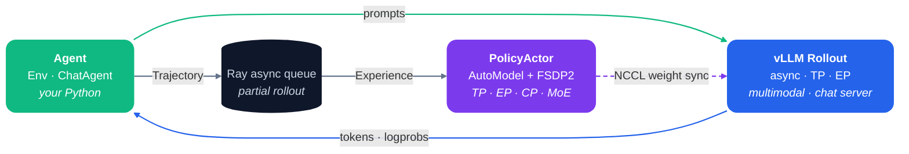

<div align="center">

# 🦋 Molt

**An agentic-first RL framework for research.**

Ray · vLLM · NVIDIA AutoModel — the smallest PyTorch-native stack for
1T-class fully-async, multimodal, multi-turn agentic RL.

<br/>

[](LICENSE)


<br/>

[**Architecture**](#-architecture) ·
[**Why Molt**](#-why-molt) ·
[**Quick Start**](#-quick-start) ·
[**Agent Contract**](#-agent-contract) ·
[**Recipes**](#-recipes) ·
[**Scaling**](#-scaling-knobs)

| Package | SFT | RL | Runtime |
|---|---|---|---|
| `molt` | `molt.cli.train_sft` | `molt.cli.train_rl_ray` | vLLM |

</div>

Molt is **agentic-first** and **PyTorch-native**. The agent is the program;
the trainer is a single actor; reward is any Python you write inside an `Env`
or `ChatAgent` — graders, multi-turn tools, VLM environments, LLM-as-judge.
Three components carry the rest — **Ray** for placement and async queues,
**vLLM** for rollout, **NVIDIA AutoModel + FSDP2** for training in pure
PyTorch. That is the whole stack: **~8.6K lines of RL code that scale to
1T-class MoE** on vLLM with TP / EP / CP — think DeepSeek-V3 at
`--fsdp.ep_size 256`, Adam CPU offload for the largest actors. One agent
API, one trainable actor, clean enough to read end-to-end.

## 🧩 Architecture

Three boxes. One async loop.



**Ray** owns placement and the async queue between the three boxes — that
is the entire runtime. The contract is **token-first**: token ids,
logprobs, action ranges, rewards, and multimodal tensors stay aligned from
rollout to training. Anything you can compute in Python is a valid reward,
including LLM-as-judge calls back through the same vLLM engines that drive
rollout.

## ✨ Why Molt

| | What you get | Why it matters for research |
|---|---|---|
| 🤖 **Agentic-first** | One Gymnasium-aligned API — `Env.step()` or `ChatAgent.run()` — covers graders, multi-turn tools, VLM environments, and OpenAI/Anthropic-compatible servers | The agent *is* the program — iterate on environments in plain Python, the trainer stays untouched |
| ⚙️ **Fully-async runtime** | Ray placement, async rollout queues, vLLM engines, partial rollout, weight sync | Rollout, training, and weight sync overlap — a DeepSeek-V3-class actor stays fed without bespoke infra |
| 🔥 **PyTorch-native, AutoModel-first** | FSDP2 + NVIDIA AutoModel, pure PyTorch end-to-end | Hack the model in the language you already write; no backend ceremony |
| 🎯 **Single-actor simplicity** | One actor, optional KL reference — the whole RL graph fits on a page | Every gradient is explicit; every loss term is one file away |
| 🚀 **Frontier-scale MoE** | AutoModel + FSDP2 + TP / EP / CP + Adam CPU offload, MoE-native — e.g. DeepSeek-V3 with `--fsdp.ep_size 256` | The same script that trains 8B scales to 1T-class MoE — no rewrite between scales |
| 🔗 **Token-first contract** | Aligned token ids, logprobs, action ranges, rewards, multimodal tensors | Multi-turn, VLM, and tool-call traces share one format end-to-end |
| 🪶 **Small, hackable surface** | ~8.6K LOC of RL code across 3 thin layers | Fork one layer without touching the others — read it in an afternoon |

## 📊 How It Compares

The RL ecosystem optimizes for breadth. Molt optimizes for
**agentic research velocity at scale** — the smallest PyTorch-native stack
that still drives fully-async agentic RL at frontier MoE scale on vLLM.

|  | **🦋 Molt** | OpenRLHF | verl | slime |
|---|:-:|:-:|:-:|:-:|
| Training backend | **PyTorch / FSDP2 + NVIDIA AutoModel** | DeepSpeed ZeRO-3 | FSDP / FSDP2 / Megatron | Megatron (FSDP exp.) |
| Rollout engine | vLLM (Ray) | vLLM (Ray) | vLLM / SGLang / TRT-LLM | SGLang only |
| RL topology | **actor (+ optional PPO critic)** | actor + critic + RM | actor + critic + RM | actor + critic + RM |
| Reward source | **agent Python** | agent / endpoint / RM | agent / RM / endpoint | rollout fn / RM |
| Parallelism | **TP / EP / CP**, MoE-native | ZeRO-3 / FSDP | TP / PP / EP / SP | TP / PP / DP / CP / EP |
| Multimodal | VLM RL, multi-turn tool calls | VLM RL (v0.10+) | Qwen2.5-VL, Kimi-VL | geo3k VLM |
| Config surface | **CLI flags only** | CLI + scripts | Hydra + YAML | CLI + YAML |
| RL code size¹ | **~8.6K LOC** | ~7.2K | ~62K | ~25K |
| Design center | **agentic-first research** | RLHF coverage | production breadth | Megatron throughput |

**One framework, one job.** Molt is the smallest PyTorch-native
stack that takes an NVIDIA AutoModel from SFT to frontier-scale agentic
RL on vLLM. Read every line that touches your gradients, in plain PyTorch.

> ¹ RL code = every Python file the framework's RL path uses — online
> trainer, rollout, Ray orchestration, experience/advantage/reward/KL/loss,
> actor/critic/RM inference, plus shared models, utils, parallelism, and
> kernels the RL training command depends on. Excludes pure SFT, DPO/KTO/IPO
> trainers, reward-model **training**, distillation, vendored third-party
> code, tests, examples, scripts, and docs. Counts code lines only (blank
> and comment-only lines excluded). Measured by tracing the import graph
> from each RL entry point (`molt.cli.train_rl_ray`,
> `openrlhf.cli.train_ppo_ray`, `verl.trainer.main_ppo`); slime loads its
> Megatron/SGLang backends lazily, so its core `slime/` package plus its
> `slime_plugins/` model-zoo (+~4.7K — the in-repo model code its RL path
> uses, counted on the same basis as molt's `models/`) are counted, minus
> SFT/distillation. Molt measured 2026-07-07 on this repo; the others
> measured 2026-06-16 at each repo's then-latest main HEAD
> (verl `86e8123`, slime `243773c`, OpenRLHF `b3d2927`).

## 🎯 Supported Scope

### Training & runtime

| Area | Support |
|---|---|
| SFT | `molt.cli.train_sft` |
| RL | vLLM-backed online RL via `molt.cli.train_rl_ray` |
| Runtime | Ray placement, async rollout queues, vLLM engines, partial rollout sync |
| Model scale | AutoModel + FSDP2 with TP / EP / CP, MoE-native — e.g. DeepSeek-V3 at `--fsdp.ep_size 256` |
| Model backend | **NVIDIA AutoModel is the primary path** — native CP / EP / TP, custom MoE+EP parallelizer, TE fused attention; everything model-side aligns with AutoModel's own recipes. The HF transformers path is a **non-preferred fallback** (AutoModel drops to it only when a model has no native class) supporting **text + flash_attention_2 + packing only — no CP / EP / TP** |
| Optimizer | `adam` (default), with CPU offload for the largest actors (`--fsdp.offload optimizer`). `muon` (Newton–Schulz via Dion: Muon for 2D weights and grouped MoE experts, AdamW for embeddings / head / norms) is **experimental** — runs distributed (FSDP / EP) but has shown no consistent win over `adam` yet, which stays the recommended default |

### Agents & rewards

| Area | Support |
|---|---|
| Agent interface | `--train.agent_path` with `Env` or `ChatAgent` subclass + an `AgentRunner` |
| Reward source | `Result(reward=...)` returned from `Env.step` or `ChatAgent.run` |
| Modalities | Text and VLM prompts, including image payloads |
| Chat templates | Assistant spans (SFT loss mask + multi-turn rollout stitching) are derived from the model's own chat template — no hard-coded markers. Verified on ChatML (Qwen3.x, Nemotron omni3), Kimi-K2.6, GLM, Gemma and DeepSeek |

### Algorithms

| Area | Support |
|---|---|
| Estimators | `reinforce`, `reinforce_baseline`, `rloo`, `grpo`, `dr_grpo`, `gae` (PPO), `on_policy_distill` |
| PPO critic | `--algo.advantage.estimator gae` adds a value model: its own Ray group (`CriticModelActor`), colocated on the actor's GPUs by default or disaggregatable, GAE advantages (`--algo.advantage.lam`) + clipped value loss (`--critic.value_clip`), own optimizer/LR (`--critic.adam.lr`) and resumable `_critic` checkpoint. Built on `NeMoAutoModelForCausalLM` + a scalar value head, so it keeps the native TP / EP / CP path |
| Distillation | On-policy distillation — per-token reverse KL to a frozen teacher, via `--algo.advantage.estimator on_policy_distill` + `--ref.model_name_or_path` |
| IS correction | `tis`, `icepop`, `seq-mask-tis` (off-policy / async rollout) |
| KL | Optional reference workers when `--algo.kl.init_coef > 0` (the reference doubles as the distillation teacher) |

### MoE routing stability

| Area | Support |
|---|---|
| Router replay (R3) | `--train.routing_replay` — vLLM's per-token top-k selection replayed in the training forward; details in the *MoE routing stability* section under Scaling Knobs |
| Router freeze | `--actor.freeze_moe_router` holds the gate/router weights fixed so vLLM and the actor keep routing tokens to the same experts. Stabilizes MoE RL / distillation and shrinks the same rollout-vs-train logprob gap the IS-correction filters address — a router that drifts between refits is a large source of that gap |

## 📦 Installation

The recommended path is the prebuilt project image on Docker Hub. It bakes the full
CUDA-13 stack (torch 2.11 · vLLM · TransformerEngine · flash-attn · mamba · DeepEP ·
NVIDIA AutoModel), so it runs SFT and RL as-is with no local build:

```bash
docker pull hijkzzz/molt:latest   # or the pinned tag hijkzzz/molt:0.1
```

`examples/scripts/docker_run.sh` defaults to this image (`IMAGE_NAME=hijkzzz/molt:latest`,
build skipped), so a full-stack sanity check is one command:

```bash
bash examples/scripts/docker_run.sh "python -c 'import vllm, transformer_engine; print(vllm.__version__); print(transformer_engine.__version__)'"
```

To build the image yourself instead (e.g. to change the CUDA / vLLM pins), point the
script at a local tag and enable the build:

```bash
IMAGE_NAME=molt:local SKIP_BUILD=0 bash examples/scripts/docker_run.sh "pytest -q"
```

For local (non-container) development:

```bash
pip install -e ".[vllm]"
```

## 🚀 Quick Start

### SFT

```bash
torchrun --standalone --nproc_per_node=8 -m molt.cli.train_sft \
  --model.model_name_or_path /path/to/automodel \
  --data.dataset /path/to/sft.jsonl \
  --data.input_key input \
  --data.output_key output \
  --ckpt.output_dir ./ckpt/sft \
  --fsdp.attn_implementation te
```

SFT uses the same AutoModel/FSDP2 model-loading path as RL.

### RL

```bash
python3 -m molt.cli.train_rl_ray \
  --actor.model_name_or_path /path/to/automodel \
  --data.prompt_dataset /path/to/prompts.jsonl \
  --data.input_key input \
  --train.agent_path examples/python/agents/math.py \
  --vllm.num_engines 2 \
  --vllm.tensor_parallel_size 2 \
  --rollout.batch_size 128 \
  --train.batch_size 128 \
  --train.micro_batch_size 1 \
  --algo.advantage.estimator reinforce \
  --algo.kl.init_coef 0 \
  --fsdp.attn_implementation te \
  --ckpt.output_dir ./ckpt/rl
```

Common RL switches:

| Goal | Flags |
|---|---|
| Disable reference workers | `--algo.kl.init_coef 0` |
| Enable KL regularization | Set `--algo.kl.init_coef` above zero and place reference workers with `--ref.num_nodes`, `--ref.num_gpus_per_node`, or `--train.colocate_fsdp_models` |
| Compare samples per prompt | `--rollout.n_samples_per_prompt 8` plus `reinforce_baseline`, `rloo`, `grpo`, or `dr_grpo` |
| Decouple rollout and training | `--train.async_queue_size 2` |
| Keep rollout alive during sync | `--train.partial_rollout_enable` |
| Filter by agent scores | `--algo.dynamic_filtering_enable --algo.dynamic_filtering_range 0.0 1.0` |
| Correct async rollout logprobs | `--algo.advantage.is_correction_enable --algo.advantage.is_correction_type seq-mask-tis` |
| Freeze MoE routing (stabilize MoE RL) | `--actor.freeze_moe_router` |
| On-policy distillation | `--algo.advantage.estimator on_policy_distill --ref.model_name_or_path /path/to/teacher` |

## 🤖 Agent Contract

Every RL run points at one Python module:

```bash
--train.agent_path /path/to/agent.py
```

The module must export `AgentRunner`. Choose **one** of two paths:

### 1. `Env` — framework owns the LLM loop *(Gymnasium-style step/reset)*

```python
from molt.agents import Env, Result, StepEnvRunner

class MathEnv(Env):
    async def step(self, state) -> Result:
        # state: observation_text, action_text, label, sampling_params
        reward = grade(state["action_text"], state["label"])
        return Result(reward=reward, terminated=True)

class AgentRunner(StepEnvRunner):
    def __init__(self):
        super().__init__(MathEnv)
```

The framework drives vLLM, tokenization, multimodal accounting, and
per-turn budgets. Your `step()` returns a `Result`; the framework chains
turns until `terminated` or `truncated`.

### 2. `ChatAgent` — you own the loop via the OpenAI **or** Anthropic SDK

```python
from openai import AsyncOpenAI
from molt.agents import ChatAgent, ChatAgentRunner, ChatContext, Result

class MyAgent(ChatAgent):
    async def run(self, ctx: ChatContext) -> Result:
        # ctx.base_url carries the session id and auto-captures the token
        # trace — no extra_body, no logprobs=True, no session plumbing.
        client = AsyncOpenAI(base_url=ctx.base_url, api_key=ctx.api_key)
        resp = await client.chat.completions.create(
            model=ctx.model_name,
            messages=[{"role": "user", "content": ctx.prompt}],
            max_tokens=ctx.sampling_params.max_tokens,
            temperature=ctx.sampling_params.temperature,
        )
        return Result(reward=grade(resp.choices[0].message.content, ctx.label))

class AgentRunner(ChatAgentRunner):
    def __init__(self):
        super().__init__(MyAgent)
```

The same server speaks the Anthropic wire too — point `AsyncAnthropic` at
`ctx.session_url` (the session root *without* `/v1`; the SDK appends
`/v1/messages` itself), everything else is identical:

```python
from anthropic import AsyncAnthropic

client = AsyncAnthropic(base_url=ctx.session_url, api_key=ctx.api_key)
msg = await client.messages.create(
    model=ctx.model_name,
    messages=[{"role": "user", "content": ctx.prompt}],
    max_tokens=ctx.sampling_params.max_tokens,
)
text = msg.content[0].text
```

A FastAPI vLLM server is auto-launched on loopback under the session URL.
External HTTP callers (browser automation, eval harnesses, OSWorld, …) hit the
same engine through either `/v1/chat/completions` (OpenAI) or `/v1/messages`
(Anthropic) — both decode to one token-exact accumulation.

#### Context compaction → multiple step-samples per rollout

Each chat call carries the prior turn's **exact** tokens forward and appends only
the new delta, so a multi-turn episode stitches into one monotonic token-exact
trajectory. But a long-horizon agent often **compacts** its context — summarizing
or dropping old turns to stay under the window (e.g. a `/compact` step) — which
*rewrites* the prefix, so it's no longer a clean extension of what was tokenized.

The server detects this automatically: when an incoming request rewrites the
prefix instead of extending it, it **seals the current segment and starts a fresh
token-exact segment** from the re-templated post-compaction conversation. One
rollout therefore emits several segment trajectories — they share the rollout's
reward and `rollout_id`, so group baselines (GRPO/RLOO/…) dedup them to *one
reward per rollout* while each segment still contributes its own generated tokens
to the policy gradient (the same step-sample contract multi-turn agents use). No
agent-side change is needed — it works on both wires, including external harnesses
(Claude Code, opencode, AgentScope, …) whose compaction is opaque to us.

### `Result` fields

| Field | Meaning |
|---|---|
| `reward` | Scalar reward consumed by the trainer (required) |
| `observation` | Next-turn observation text (multi-turn only) |
| `terminated` | Episode finished naturally; defaults to `True` |
| `truncated` | Cut off externally (max turns, length, etc.) |
| `info` | Optional dict of scalar diagnostics for logging |
| `score` | Optional dynamic-filtering / dashboard score (defaults to `reward`) |
| `images` | Optional list of next-turn images |
| `sampling_params` | Optional per-turn override |

Four reference agents ship under `examples/python/agents/`:

```bash
--train.agent_path examples/python/agents/math.py          # Env: single-turn boxed grader
--train.agent_path examples/python/agents/geo3k.py         # Env: VLM multi-turn + Python tool
--train.agent_path examples/python/agents/chat_minimal.py  # ChatAgent: hello-world chat loop
--train.agent_path examples/python/agents/chat_geo3k.py    # ChatAgent: VLM multi-turn + Python tool
```

## 🍳 Recipes

Reference launch scripts live under `examples/scripts/`. Two end-to-end
families ship today, both on the AutoModel + FSDP2 backend:

| Workflow | quick_start | slurm |
|---|---|---|
| Qwen3.6-35B-A3B VLM SFT on geo3k | `quick_start/sft_qwen3_6_35b.sh` | `slurm/sft_qwen3_6_35b.sh` |
| Qwen3.6-35B-A3B VLM RL on geo3k (multi-turn Python tool) | `quick_start/rl_qwen3_6_35b.sh` | `slurm/rl_qwen3_6_35b.sh` |
| Qwen3-4B dense SFT on text math | `quick_start/sft_qwen3_4b.sh` | `slurm/sft_qwen3_4b.sh` |
| Qwen3-4B dense RL on text math | `quick_start/rl_qwen3_4b.sh` | `slurm/rl_qwen3_4b.sh` |

Quick-start single-node usage:

```bash
MODEL_PATH=/path/to/Qwen3-4B bash examples/scripts/quick_start/rl_qwen3_4b.sh
```

The geo3k VLM scripts (`rl_qwen3_6_35b.sh` / `sft_qwen3_6_35b.sh`) auto-prepare the
dataset on first run via `examples/python/utils/prepare_geo3k.py`. To pre-stage it
manually (or refresh it), run:

```bash
python3 examples/python/utils/prepare_geo3k.py --num-proc 8 --out-dir .tmp/geo3k
```

Or point `PROMPT_DATASET` / `EVAL_DATASET` at your own data.

Slurm usage:

```bash
# 1) SFT smoke on interactive 2 nodes
sbatch examples/scripts/slurm/sft_qwen3_6_35b.sh

# 2) RL smoke on interactive 2 nodes (auto-preps geo3k on first run)
sbatch examples/scripts/slurm/rl_qwen3_6_35b.sh

# 3) Scale RL to 4 nodes for convergence
sbatch --nodes=4 examples/scripts/slurm/rl_qwen3_6_35b.sh
```

### Multi-turn Python tool env

`examples/python/agents/geo3k.py` is the VLM multi-turn recipe used by the
Qwen3.6 RL script. The model emits a `<tool_call>` invoking
`python_executor(code=...)`; the env runs the snippet in a sandboxed
subprocess and feeds the captured stdout back as a `<tool_response>` turn.
The loop runs up to `MAX_AGENT_TURNS` (default 5); the final
`<answer>ANSWER</answer>` (or `\boxed{ANSWER}` for legacy distributions) is
graded against the ground truth and becomes the reward.

### OpenAI- / Anthropic-compatible server agent

For agents that already speak OpenAI Chat Completions or the Anthropic Messages
API, subclass `ChatAgent` (see `examples/python/agents/chat_minimal.py`). The
auto-launched server exposes both `/v1/chat/completions` and `/v1/messages`
against the rolling vLLM engines, so any external loop (browser automation, eval
harness, OSWorld …) can drive the policy through a stock OpenAI or Anthropic SDK
— both wires decode to the same token-exact trajectory capture.

### On-policy distillation

Distill a student onto a frozen teacher on the student's *own* on-policy
samples. A single switch —
`--algo.advantage.estimator on_policy_distill` — turns the reference model into
the teacher and makes the per-token **reverse KL** to it the entire training
signal: the advantage becomes `-kl_coef · (log π_student − log π_teacher)` with
no scalar reward, no group baseline, and no whitening, so the policy loss is the
policy-gradient estimator of the reverse-KL gradient that pulls the student onto
the teacher.

```bash
python3 -m molt.cli.train_rl_ray \
  --actor.model_name_or_path /path/to/student \
  --ref.model_name_or_path /path/to/teacher \
  --algo.advantage.estimator on_policy_distill \
  --data.prompt_dataset /path/to/prompts.jsonl \
  --data.input_key input \
  # vllm / fsdp / batch flags as in the RL quick start
```

Everything else is derived from the one switch, so pure distillation needs no
reward function and no task agent — only the teacher checkpoint. Selecting the
estimator forces `--algo.kl.estimator k1`, turns `--algo.kl.use_loss` off (the
KL flows through the advantage, not a separate loss term), defaults
`--algo.kl.init_coef` to `1.0`, and — when no `--train.agent_path` is given —
auto-selects a built-in single-turn, VLM-aware generator
(`molt/agents/distill_agent.py`) that samples one on-policy completion per
prompt and returns a dummy `0.0` reward the estimator ignores.

The teacher **must share the student's processor/tokenizer** so the per-token
logprobs align over the same (vision-expanded) sequence — typically a larger or
more-trained checkpoint from the same family. It loads inference-only and can be
colocated on the actor nodes (`--train.colocate_fsdp_models`) or given its own
`--ref.num_nodes`. Watch `kl` / `logprobs_diff` fall toward 0 as the student
matches the teacher; task accuracy is not the objective, so eval is off.

To distill a **multi-turn tool-use distribution** (matching how the student is
actually deployed), point `--train.agent_path` at the task's real agent (e.g.
`chat_geo3k.py`) — its reward is simply ignored by the estimator.
`examples/scripts/slurm/rl_distill_omni3_30b.sh` is a ready VLM example off the omni3
EP8 / CP8 / TE / DeepEP recipe.

## 🎛️ Scaling Knobs

Molt targets AutoModel custom models with FSDP2:

| | Mode | Flag |
|---|---|---|
| **Actor** | Tensor parallel | `--fsdp.tp_size 2` |
| | Expert parallel | `--fsdp.ep_size 8` (e.g. `256` for DeepSeek-V3-class MoE) |
| | Context parallel | `--fsdp.cp_size 8` (32K+ sequences) |
| | Optimizer CPU offload | `--fsdp.offload optimizer` (frees VRAM for the largest actors) |
| **vLLM rollout** | Tensor parallel | `--vllm.tensor_parallel_size 2` |
| | Expert parallel | `--vllm.enable_expert_parallel` |
| | Scheduler token budget | `--vllm.max_num_batched_tokens 32768` |
| | MTP spec-decode | `--vllm.mtp_num_speculative_tokens 1` |
| **MoE stability** | Router replay (R3) | `--train.routing_replay` |
| | Router freeze | `--actor.freeze_moe_router` |

For CP training, packed RL batches are currently disabled. Packing is off by
default, and CP rejects `--fsdp.packing_samples`.

### ⚡ MTP rollout (speculative decoding)

Checkpoints that ship a multi-token-prediction (MTP) head — e.g. **Qwen3.6-MoE**
(`mtp_num_hidden_layers: 1`) — can use it to **speed up generation** via vLLM
speculative decoding. One flag turns it on:

```bash
--vllm.mtp_num_speculative_tokens 1   # 0 = off (default); 1 is a good default
```

vLLM auto-detects the per-architecture MTP draft from the served checkpoint
(`qwen3_5_moe → qwen3_5_mtp`), drafts *N* tokens, and the target model verifies
each by rejection sampling. This is **lossless**: accepted tokens follow the
target policy's distribution, so the rollout log-probs stay unbiased for the RL
objective — it only changes throughput, never the learned policy.

Notes:
- **Rollout-only.** Like verl and NeMo-RL, the RL/SFT loss is **main-head-only**;
  Molt does not train the MTP head. The draft shares `embed_tokens`/`lm_head` with
  the target (refreshed every weight broadcast), so it tracks the updating policy;
  only the small MTP block stays at its checkpoint weights, so acceptance degrades
  gracefully rather than off a cliff.
- **Model support is vLLM-side.** Qwen3.6-MoE works out of the box. The official
  Nemotron-Nano-Omni HF checkpoint ships **no** MTP head, and vLLM 0.24 only
  auto-detects MTP for the *Super*-Omni arch (not Nano) — so omni3 rollout-MTP is
  unavailable until upstream adds it; vLLM errors at engine init if enabled on an
  unsupported checkpoint.

### 🎯 MoE routing stability — Router Replay (R3) & router freeze

MoE RL is unstable because the rollout (vLLM) and training (FSDP) routers pick
experts **independently** — even at identical weights, numerical differences
flip a fraction of the top-k per layer, compounding until most tokens route to
different experts than they did during rollout. That breaks the importance-
sampling assumption behind GRPO/GSPO. Molt closes the gap at three levels — the
first two are on by default in the qwen3.5-moe recipes, the third is an optional
heavier alternative to R3:

**fp32 router precision (default).** The gate linear + expert-output combine run in
fp32 (matching vLLM's fp32 router) so the two sides agree on the gate *weights* to
begin with. A bf16 router silently drifts from vLLM and makes `vllm_kl` climb with
training. Override with `MOLT_GATE_PRECISION=bfloat16`.

**Rollout Routing Replay (R3, default)** — fix the top-k *selection* at the source
([arXiv:2510.11370](https://arxiv.org/abs/2510.11370)): vLLM returns the per-token
expert ids it chose, and the training forward replays that exact selection.

```bash
--train.routing_replay   # default in the qwen3.5-moe recipes
```

- **Freezes the routing, not the router.** Only the discrete top-k *selection* is
  replayed; the router logits are still recomputed from the live weights, so the
  gradient keeps flowing into the router (it keeps learning).
- **Full-sequence, absolute-position aligned**: routing is laid down by token
  position; positions the engine returns no routing for keep their natural selection.
- Needs AutoModel `RouterReplay` (`nemo_automodel.components.moe.router_replay`,
  PR #2797). Incompatible with `--train.partial_rollout_enable` (vLLM frees routing
  on preemption).

**Router freeze (optional, blunter).** Hold the gate/router weights fixed so the
routing can't drift at all — excludes the router from the optimizer *and* the refit,
so vLLM and the actor route to the same experts **by construction**, no engine
support needed. The trade-off: the router stops learning, so it's **redundant with
R3** and off by default; reach for it only if routing drift still dominates and a
fixed router is acceptable.

```bash
--actor.freeze_moe_router   # off by default; redundant with R3
```

## ✅ Validation

Fast local checks:

```bash
python -m compileall -q molt examples/python tests
pytest -q
```

Container checks:

```bash
SKIP_BUILD=1 DOCKER_GPUS=all DOCKER_SHM_SIZE=32g \
  bash examples/scripts/docker_run.sh "pytest -q"
```

## 🙏 Acknowledgement

Molt is based on OpenRLHF and keeps its Python package layout where
practical. The active architecture is intentionally minimal: a
Gymnasium-aligned agent (`Env` / `ChatAgent`), a single trainable actor,
optional KL reference workers, vLLM generation, and online policy
optimization — all on PyTorch + AutoModel.

## 🤝 Contributing

External contributions are welcome — see [CONTRIBUTING.md](CONTRIBUTING.md).
All commits must be signed off (`git commit -s`) per the
[Developer Certificate of Origin (DCO)](https://developercertificate.org/).

## 📄 License

[Apache License 2.0](LICENSE). Copyright and third-party attributions:
[NOTICE](NOTICE) and [THIRD_PARTY_NOTICES.md](THIRD_PARTY_NOTICES.md).
